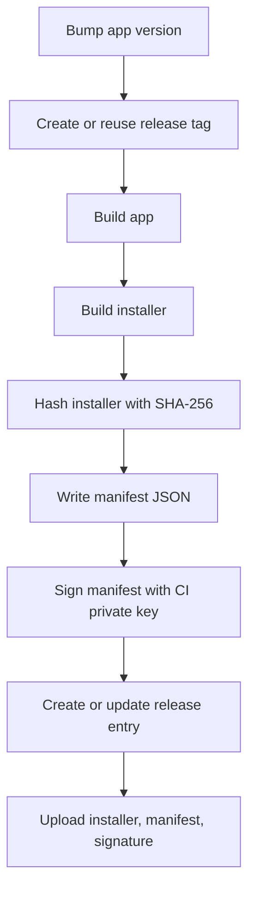
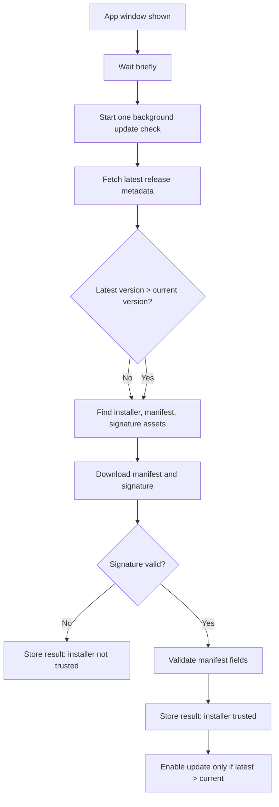
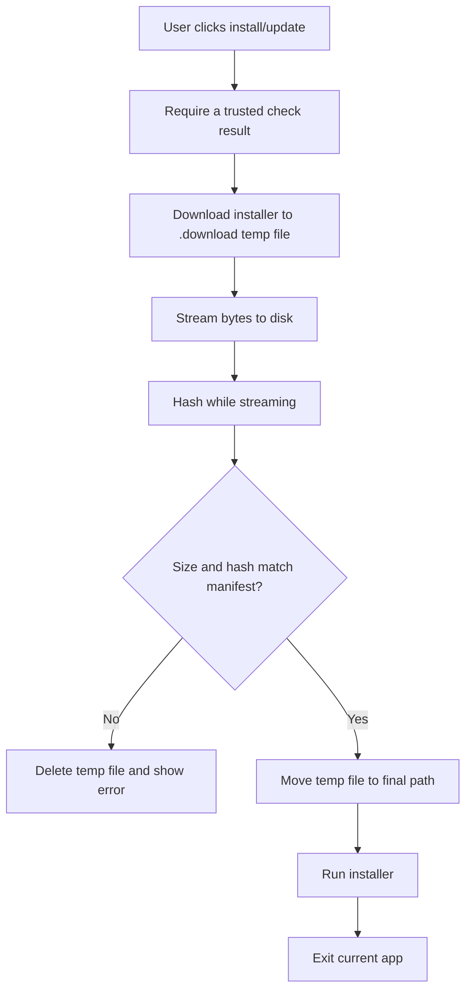

# Project-Agnostic Updater Flow

This updater pattern has two halves:

1. The release pipeline publishes an installer plus a signed manifest.
2. The app checks the latest release, verifies the manifest, downloads the installer, verifies the bytes, then runs the installer.

The release host can be GitHub Releases, S3, a static CDN, or any endpoint that can answer "what is the latest version?" and serve immutable assets. The trust boundary is the signed manifest, not the release host.

## Moving Parts

- **Current app version**: read from the running binary or package metadata.
- **Latest release endpoint**: returns a version/tag and downloadable assets.
- **Installer asset**: the real update payload, for example `MyApp-Setup.exe`.
- **Manifest asset**: JSON metadata for the installer.
- **Signature asset**: signature over the exact manifest bytes.
- **Public key in the app**: used to verify the manifest signature.
- **Private key in CI only**: used to sign the manifest during release.

## Release Flow



The build creates three updater-critical files:

- `MyApp-Setup.exe`
- `MyApp-Setup.exe.manifest.json`
- `MyApp-Setup.exe.manifest.sig`

The manifest is small and boring:

```json
{
  "schemaVersion": 1,
  "version": "1.2.3.4",
  "tag": "v1.2.3.4",
  "assetName": "MyApp-Setup.exe",
  "downloadUrl": "https://example.com/releases/download/v1.2.3.4/MyApp-Setup.exe",
  "sha256": "64 lowercase hex characters",
  "sizeBytes": 12345678,
  "createdUtc": "2026-06-29T00:00:00.0000000Z"
}
```

Release rules:

- Tags use the same version as the app, usually `vX.Y.Z.W`.
- The installer filename is stable so the app can find it.
- The manifest includes the installer hash and size.
- The signature is computed over the exact UTF-8 manifest bytes.
- CI must fail if the private signing key is missing.
- The private key never ships with the app.
- Release notes are optional; the updater does not trust or parse them.

## App Startup Flow



The startup check is intentionally lazy:

- It waits until the UI is visible.
- It runs once unless the user manually checks again.
- It coalesces duplicate checks by returning the in-flight task.
- It reports state through a simple status-changed event.
- It does not download or install anything without the user's action.

## Check Logic

The check compares normalized versions and verifies installer metadata:

1. Read the current version from the running app.
2. Fetch the latest release metadata.
3. Parse the release tag as a version, allowing a leading `v`.
4. Find all trusted installer assets:
   - installer
   - manifest
   - manifest signature
5. Verify the manifest signature with the baked-in public key.
6. Deserialize the manifest.
7. Validate the manifest against the release metadata.
8. Set `CanInstall` when the signed installer is valid.
9. Set `CanDownload` only when the signed installer is valid and latest is greater than current.
10. Store an `UpdateCheckResult` that the UI can render.

Validation should fail closed. A newer release with missing or invalid trusted metadata should show a warning/status, not enable installation.

Keeping `CanInstall` separate from `CanDownload` lets a portable build install itself from the latest signed installer even when it is already on the latest version.

## Manifest Validation

Validate these before enabling install or download:

- `schemaVersion` is supported.
- `tag` exactly matches the release tag.
- `version` parses and equals the release version.
- `assetName` is the expected installer asset name.
- `sizeBytes` is positive and matches the release asset size.
- `sha256` is valid 64-character hex.
- `createdUtc` parses as a timestamp.
- `downloadUrl` is absolute HTTPS.
- `downloadUrl` exactly matches the release asset URL.
- The URL path points to the expected owner/project/tag/asset, if your host has predictable paths.

The important idea: the app trusts only a manifest signed by your private key, and the manifest is tied back to the release metadata.

## Download Flow



Download rules:

- Save into a per-user app data update directory.
- Use a temporary filename like `MyApp-Setup.exe.download`.
- Stream the response instead of buffering the whole installer.
- If the server provides `Content-Length`, compare it to the manifest size early.
- Count received bytes and compute SHA-256 while streaming.
- Delete partial downloads on failure.
- Move the temp file into place only after verification.

## Install Flow

Before running the installer, validate the saved file again:

- File exists.
- File size matches the manifest.
- File hash matches the manifest.

Then start the installer with unattended flags appropriate for your installer technology and exit the current app.

For Inno Setup, the flags are commonly:

```text
/VERYSILENT /SUPPRESSMSGBOXES /NORESTART /CLOSEAPPLICATIONS
```

The installer should be configured to close the running app and relaunch it when silent installation completes.

## UI State Model

Keep the UI thin. The updater service owns the state; the UI only renders it.

Useful service state:

- `CurrentVersion`
- `LastResult`
- `IsChecking`
- `IsDownloading`
- `DownloadProgress`
- `StatusChanged`

Useful result fields:

- `CurrentVersion`
- `LatestVersion`
- `LatestVersionText`
- `IsUpdateAvailable`
- `CanDownload`
- `CanInstall`
- `ReleaseUrl`
- `AssetName`
- `DownloadUrl`
- `AssetSizeBytes`
- `AssetSha256`
- `Message`

The UI can then do the simple thing:

- Disable "check" while checking or downloading.
- Enable "download/install" only when `CanDownload` is true.
- Enable "install app" only when `CanInstall` is true and the current app is not already installed.
- Show progress while downloading.
- Show a subtle marker if an update is available.
- Show validation failures as status text instead of crashing.

## Error Handling

Recommended behavior:

- Network failure: store an error result with a readable message.
- Latest release missing: store "no release".
- Bad version tag: store "latest tag is not a version".
- Missing assets: store "update found, but trusted assets are missing".
- Invalid signature or manifest: store "update found, but manifest validation failed".
- Download hash/size mismatch: delete temp file and show an error.
- User cancellation: let cancellation propagate if the caller supports it.

Do not install from an untrusted or incomplete result.

## Porting Checklist

1. Pick stable asset names.
2. Generate a signing key pair.
3. Store the private key as a CI secret.
4. Bake the public key into the app.
5. Add build logic to write and sign the manifest.
6. Upload installer, manifest, and signature with every release.
7. Implement latest-release lookup for your release host.
8. Verify manifest signature before trusting any update metadata.
9. Verify installer size and hash during download.
10. Verify installer size and hash again before execution.
11. Keep download/install manual unless you explicitly want automatic updates.

## What To Change Per Project

- Repository or release-host endpoint.
- Version source and version format.
- Installer asset name.
- Update download directory.
- Public signing key.
- Manifest URL validation rules.
- Silent installer arguments.
- Relaunch behavior after installation.

## What Not To Change

- Sign the manifest, not just the installer.
- Verify signature before reading manifest values as trusted.
- Check both size and hash.
- Fail closed on missing or invalid metadata.
- Keep the private key out of the app and repo.
- Use one in-flight update check at a time.
